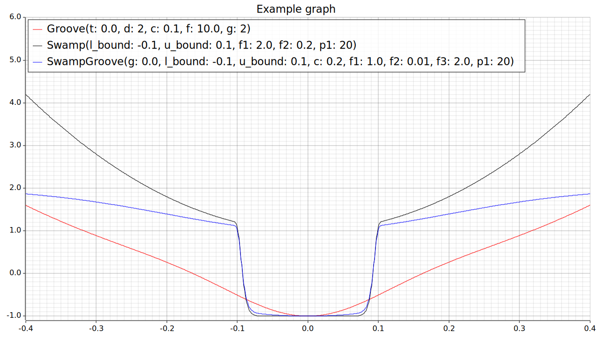
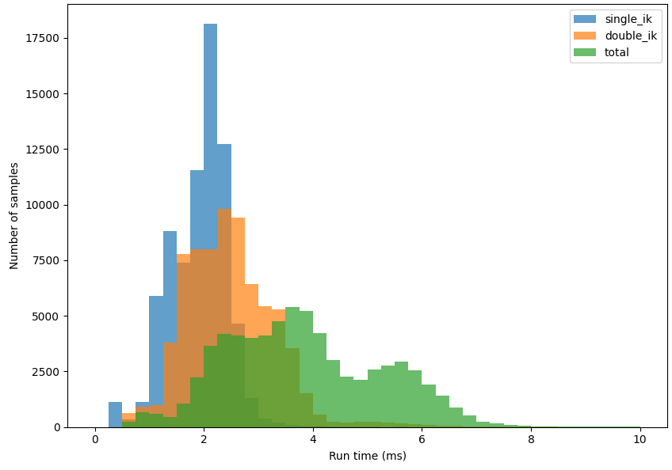

# Relaxed IK 

This project is part of a Master's thesis in robotics at the National University of Singapore, School of Computing.

**Thesis**: Leveraging Rust for real time low computational Robotics  
**Author**: Guilhem Mathieux (@guimath)  
**Advisor**: Lin Shao

This repository is a fork of [relaxed IK core](https://github.com/uwgraphics/relaxed_ik_core.git) by the University of Wisconsin-Madison's Graphics Group. It proposes some optimizations, code improvements and added functionality. It also incorporates a motion planner to have complete functionality for robotics motion control.

## Introduction

The increasing complexity of modern robotic arms has led to significant increases in computational time, primarily due to the growing dimensionality of the problems they must solve. While this is manageable for applications that can pre-compute movements on powerful computers, it poses challenges for real-time applications, resulting in excessive latency.

In this thesis, we present an efficient, low-computation method for generating manipulator movements by formulating the pose generating task as an optimization problem and utilizing Rapid exploring Random Trees in order to determine a viable path to the intended goal. The entire project is implemented in Rust, leveraging its safety features and performance advantages.


Figure : example of a pre-grasp motion fully generated by this system, visualized in simulation.


Figure : example of a grasp motion fully generated by this system, run in real life.

<!-- 
Figure : real life example -->

For detailed information on the work, see the [full thesis](master_thesis.pdf)

## Getting Started 

### Build 
1. [Install Rust](https://www.rust-lang.org/learn/get-started)
2. Run the interactive demo:
    ```bash
    make reach_full
    ```
    or 
    ```bash
    cargo run --example reach
    ```

To compile the python wrapper use maturin:
1. start by initializing the venv: 
    ```bash
    make init_env
    ```
    or 
    ```bash
    python3 -m venv .venv
    . .venv/bin/activate
    pip install -U pip maturin
    ```
2. build using
    ```bash
    make build_python
    ```
    or
    ```bash
    maturin develop -F python_wrap
    ```


### Config files
The config files are written in toml, and allow for robot specific modifications. 
- urdf_paths: Paths relative to config file
    - robot
    - obstacles
- packages: List of package names used in urdf files (not mandatory, can help speed up urdf load)
- links:
    - base: name of the base link
    - ee: name of end-effector target 
    - used_joints: list of all joints to be used
- starting_joint_values: joint values to be considered as reset. Default = 0.0 for all
- approach_dist: additional distance for pre grasp motion. Default = 0.03

For examples of config files see [xarm6 file](configs/xarm6.toml) or [ur5 file](configs/ur5.toml).

Objective weights and cost function can also be specified for example:
```toml
[objectives.x_pos]
func= {Groove={t = 0.0, d = 2, c = 0.1, f = 10.0, g = 2}}
weight= 70
```
An objective can be fully disabled by making the weight = 0.

For more examples and all the defaults objective configs, see the [default file](configs/default.toml)

## Examples

- [bench.rs](examples/bench.rs) runs a large batch of gradients calculation on the different active objectives to test time needed on each (gradient being the most computational heavy operation as it requires many objective calls for each gradient)

|Objective name | batch runtime (ms)| isolated without baseline (ms) | 
| -- | -- | -- |
Base line               | 2952   | 0            |                       
MatchEEPosiDoF (Z)      | 3812   | 860          |                                       
MatchEEPosiDoF (X)      | 3876   | 923          |                                       
MatchEEPosiDoF (Y)      | 3846   | 893          |                                       
HorizontalArm           | 3685   | 733          |                                   
HorizontalGripper       | 4870   | 1917         |                                       
EachJointLimits (0)     | 3755   | 803          |                                       
MinimizeVelocity        | 3555   | 602          |                                   
MinimizeAcceleration    | 3762   | 809          |                                       
MinimizeJerk            | 3844   | 892          |                               
MaximizeManipulability  | 23025  | 20072        |                                           
SelfCollision (0 – 2)   | 5576   | 2623         |                                           
- [cost_viz.rs](examples/cost_viz.rs) simple visualization tool to plot a given cost function. See the [example.toml](examples/cost_configs/example.toml) file for an example of plot with 3 different cost function.

Figure: Graph produced by running cost_viz on the [example.toml](examples/cost_configs/example.toml) config.

- [metric.rs](examples/metric.rs) Scan large area around the robot either computing IK or Motion and saves data to a bin file. May take a while for precise scan (especially for motion)
- [plot_metric.rs](examples/plot_metric.rs) plots a metric bin file to a heatmap. Plots can be configured by modifying the toml file produced along the bin files to change axis labels, scale range & title and more. 

Figure: Cost visualization heatmap of IK over the XY plane at Z=0.3m produced with metric and plot_metric. 

- [reach.rs](examples/reach.rs) Visualize robot and see motion and inverse kinematic results in simulation

Figure: Screen of visualization tool when running in "full" mode. 

- [time_bench.rs](examples/time_bench.rs) runs a large batch of calculation on a given area and saves detailed run time for each sample in csv file. Said CSV file can be easily exploited in python (basic processing of csv and plotting in a histogram in [time_bench_plot.py](time_bench_plot.py))  

Figure: histogram of runtime for Xarm6 produced via data from [time_bench.rs](examples/time_bench.rs) and plotting from [time_bench_plot.py](time_bench_plot.py)


The metric and reach examples have some helper commands, see the [Makefile](Makefile)   
